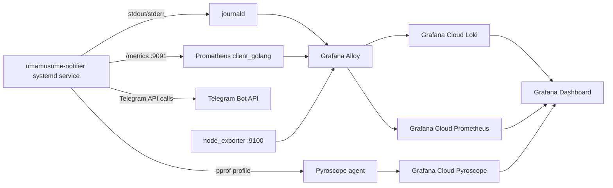

# umamusume-notifier-observability-plan

## Status

Proposed revised observability plan based on the review of the original implementation plan.

## Target

`umamusume-notifier` is a Go Telegram reminder bot running as a systemd service on Ubuntu, using SQLite storage and no HTTP inbound traffic.

The goal of this plan is to provide production-oriented observability focused on the bot's actual behavior:

- Is the service running?
- Is it processing commands?
- Are reminders being scheduled and delivered?
- Is Telegram API communication healthy?
- Is SQLite or the scheduler becoming slow?
- Is the process consuming abnormal resources?
- Can failures be investigated through logs, metrics, and profiling?

Grafana Cloud is already available with Prometheus, Loki, and Pyroscope.

---

# Observability Flow



## Port convention

Use:

- `node_exporter`: `9100`
- `umamusume-notifier /metrics`: `9091`
- `process-exporter`: `9256`, only if it is later required

The application metrics endpoint should bind to localhost only:

```go
http.ListenAndServe("127.0.0.1:9091", nil)
```

This keeps the metrics endpoint inaccessible from the network while allowing local Alloy scraping.

---

# Phase 1 — Zero-Code Signals

Start with host, systemd, and journald observability before modifying the application.

## Objectives

Immediately obtain visibility into:

- service availability
- service restarts
- process CPU
- process memory
- file descriptors
- host health
- application stdout/stderr
- panics and crashes

## Steps

| Step | Action | Output |
| --- | --- | --- |
| 1.1 | Install Grafana Alloy on the Ubuntu host | Local collector agent |
| 1.2 | Configure `loki.source.journal` for `umamusume-notifier.service` | Application logs in Grafana Cloud Loki |
| 1.3 | Install node_exporter with systemd collector enabled | Host and systemd service metrics |
| 1.4 | Configure Alloy to scrape node_exporter on `9100` | Host metrics in Grafana Cloud Prometheus |
| 1.5 | Optionally install process-exporter on `9256` if application/process-level metrics prove insufficient | Additional process metrics |
| 1.6 | Validate journald, Loki, systemd state, and metrics before changing application code | Confirms the base observability pipeline |

## Recommendation

Do not make process-exporter mandatory initially. For a single Go process, the application's Prometheus process collector plus node_exporter may already provide sufficient CPU, memory, FD, and goroutine visibility.

Add process-exporter only if there is a concrete monitoring gap.

---

# Phase 2 — Structured Logging

Replace ad-hoc logging with Go `log/slog`.

## Objectives

Make logs searchable and useful for troubleshooting without creating excessive label cardinality.

## Steps

| Step | Action |
| --- | --- |
| 2.1 | Introduce `log/slog` with a JSON handler writing to stdout |
| 2.2 | Add structured logs for command reception |
| 2.3 | Add structured logs for reminder scheduling and firing |
| 2.4 | Add structured logs for Telegram API errors |
| 2.5 | Add structured logs for SQLite/storage errors |
| 2.6 | Keep identifiers such as `chat_id` as log fields when required for troubleshooting |
| 2.7 | Do not use `chat_id`, chat title, raw user text, or raw error messages as Prometheus/Loki labels |
| 2.8 | Configure Alloy/Loki parsing so JSON fields can be searched efficiently |

Example:

```json
{
  "level": "INFO",
  "msg": "command received",
  "command": "/status",
  "chat_id": "123456789"
}
```

The `chat_id` can remain in the log event, but should not become a metric label.

---

# Phase 3 — Application Metrics

Add `github.com/prometheus/client_golang`.

Expose:

```text
http://127.0.0.1:9091/metrics
```

Alloy scrapes the endpoint locally and sends metrics to Grafana Cloud Prometheus.

## Core Command Metrics

```text
bot_commands_total{command,outcome}
```

Purpose:

- command volume
- successful commands
- failed commands
- command-specific troubleshooting

Keep the command set bounded to known commands such as:

```text
/status
/use
/set
/elapsed
/regen
```

Do not use user-provided text as a label.

---

# Reminder Metrics

The reminder system is the core business function of the application, so it should receive more visibility than generic process metrics.

Add:

```text
bot_reminders_scheduled_total
bot_reminders_sent_total{outcome}
bot_reminders_failed_total
bot_reminder_delivery_delay_seconds
bot_scheduler_queue_size
```

## Why delivery delay matters

A bot can be technically healthy:

```text
systemd = active
CPU = normal
RAM = normal
goroutines = normal
```

while reminders are being delivered late.

For example:

```text
Expected: 16:00:00
Actual:   16:00:30
Delay:    30 seconds
```

`bot_reminder_delivery_delay_seconds` makes this problem directly observable.

Recommended use:

- histogram for delivery delay
- monitor p95/p99 when appropriate
- investigate sustained increases

---

# Telegram API Metrics

Use bounded labels.

```text
bot_telegram_api_requests_total{method,outcome}
bot_telegram_api_duration_seconds{method}
bot_telegram_api_errors_total{method,error_type}
```

Examples:

```text
method="sendMessage"
outcome="success"
```

or:

```text
method="sendMessage"
outcome="error"
```

`error_type` should use controlled categories such as:

```text
rate_limit
network
timeout
telegram_api
unknown
```

Do not use the complete raw error message as a label.

---

# SQLite Metrics

Add:

```text
bot_storage_op_duration_seconds{op}
```

Where `op` is a bounded operation name such as:

```text
read
write
insert_reminder
update_reminder
delete_reminder
```

The exact operation names should match the actual application implementation.

The objective is to identify SQLite latency before it becomes visible as user-facing reminder or command failures.

---

# Go Runtime Metrics

Use the default Prometheus Go collectors:

```text
go_goroutines
go_memstats_*
process_cpu_seconds_total
process_resident_memory_bytes
process_open_fds
process_max_fds
```

These provide:

- goroutine growth/leaks
- Go heap/runtime behavior
- process CPU
- RSS
- file descriptor usage

---

# Phase 4 — Grafana Dashboard and Alerts

Build the dashboard before adding continuous profiling.

The dashboard should follow the operational triage flow:

```text
1. Is it up?
        ↓
2. Is it doing its job?
        ↓
3. Is something failing or slow?
        ↓
4. Why is it happening?
```

## Row 1 — Availability

Panels:

- Service UP/DOWN
- Restart count
- Uptime since last restart

Primary metric:

```promql
node_systemd_unit_state{
  name="umamusume-notifier.service",
  state="active"
}
```

---

## Row 2 — Command and Reminder Activity

Panels:

- Commands/min by command and outcome
- Reminders scheduled
- Reminders sent
- Reminder failures
- Reminder delivery delay
- Scheduler queue size
- Reminder success rate

Example:

```promql
rate(bot_commands_total[5m])
```

Grouped by:

```text
command
outcome
```

Reminder success rate should be based on the actual reminder sent/failed metrics.

---

## Row 3 — Errors and Latency

Panels:

- Telegram API error rate
- Telegram API p95 latency
- SQLite operation p95 latency
- Reminder delivery delay p95
- Recent error logs from Loki

Example:

```promql
histogram_quantile(
  0.95,
  rate(bot_telegram_api_duration_seconds_bucket[5m])
)
```

---

## Row 4 — Resources and Deep Dive

Panels:

- Goroutines
- RSS
- CPU
- File descriptors
- Scheduler queue size
- Pyroscope/flamegraph link

Primary metrics:

```text
go_goroutines
process_resident_memory_bytes
process_cpu_seconds_total
process_open_fds
bot_scheduler_queue_size
```

---

# Alerts

The alerting strategy should prioritize user-facing functionality rather than generic resource thresholds.

## 1. Service Down — Critical

Trigger when the systemd service is not active for 5 minutes.

Conceptually:

```promql
node_systemd_unit_state{
  name="umamusume-notifier.service",
  state="active"
} != 1
```

for:

```text
5m
```

---

## 2. Restart Loop — Warning/Critical

Alert when the service restarts repeatedly within a short period.

The exact threshold should be tuned using actual production behavior.

---

## 3. Reminder Failure Spike — Warning

Alert when the proportion of failed reminder deliveries exceeds an agreed threshold for a sustained period.

Example starting point:

```text
> 5% failures for 10 minutes
```

The threshold should be adjusted after observing normal traffic.

---

## 4. Scheduler Delivery Delay — Warning

Alert when reminder delivery latency becomes excessive.

Example starting point:

```text
p95 delivery delay > 30 seconds
```

for a sustained period.

This is particularly valuable because the service may still appear healthy at the infrastructure level.

---

## 5. Telegram API Failure — Warning

Alert on sustained Telegram API failures or rate limiting.

Separate:

```text
network/timeout
rate_limit
Telegram API error
```

so the alert can distinguish external Telegram problems from local application problems.

---

# Phase 5 — Continuous Profiling

Pyroscope remains optional.

Only add it after the dashboard and alerts are working.

## Use cases

Profiling becomes useful when investigating:

- unexpected CPU usage
- memory growth
- scheduler performance
- SQLite-related CPU consumption
- goroutine behavior
- unexplained performance degradation

## Implementation

Add:

```text
github.com/grafana/pyroscope-go
```

Start profiling with:

```text
ApplicationName = "umamusume-notifier"
```

Useful tags:

```text
env=prod
host=<hostname>
```

Push profiles to the existing Grafana Cloud Pyroscope stack.

---

# Recommended Final Architecture

```text
                         Grafana Cloud
                  ┌──────────┼──────────┐
                  │          │          │
                Loki     Prometheus  Pyroscope
                  │          │          │
                  └──────────┼──────────┘
                             │
                         Grafana
                             │
                    ┌────────┴────────┐
                    │                 │
                 Alloy             Profiling
                    │
          ┌─────────┼─────────┐
          │         │         │
     journald   node_exporter  app /metrics
          │         │         │
          └─────────┼─────────┘
                    │
           umamusume-notifier
                    │
        ┌───────────┼───────────┐
        │           │           │
     Telegram    Scheduler    SQLite
```

---

# Implementation Priority

The recommended rollout order is:

```text
Phase 1
Host + systemd + journald
        ↓
Phase 2
Structured logging
        ↓
Phase 3
Application metrics
        ↓
Phase 4
Grafana dashboard + alerts
        ↓
Phase 5
Pyroscope (optional)
```

This order ensures that useful observability is available as early as possible and that profiling does not become a prerequisite for basic monitoring.

---

# Final Checklist

- [ ] Standardize application metrics endpoint on `127.0.0.1:9091`
- [ ] Keep node_exporter on `9100`
- [ ] Deploy Grafana Alloy
- [ ] Collect `umamusume-notifier.service` journald logs
- [ ] Deploy node_exporter with systemd metrics
- [ ] Decide whether process-exporter is actually required
- [ ] Replace ad-hoc logging with `slog`
- [ ] Keep `chat_id` as a log field, not a metric label
- [ ] Add command metrics
- [ ] Add reminder scheduled/sent/failed metrics
- [ ] Add reminder delivery-delay histogram
- [ ] Add scheduler queue metric
- [ ] Add Telegram request/latency/error metrics
- [ ] Add SQLite operation latency metrics
- [ ] Expose `/metrics` on localhost only
- [ ] Configure Alloy to scrape application metrics
- [ ] Build the four dashboard rows
- [ ] Add service-down alert
- [ ] Add restart-loop alert
- [ ] Add reminder failure alert
- [ ] Add scheduler delivery-delay alert
- [ ] Add Telegram failure/rate-limit alert
- [ ] Add Pyroscope only if deeper profiling is needed
